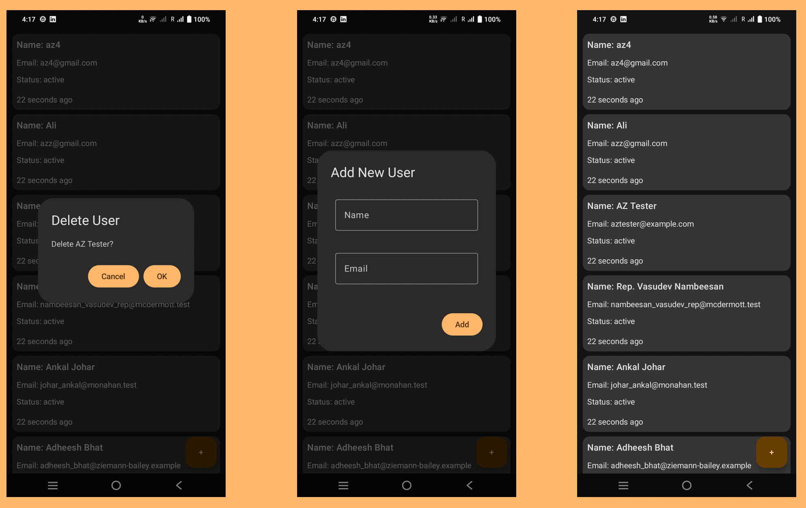

# Sliide Android App Test

Welcome to the **Sliide User Management Android App**, a robust Android application exemplifying **Clean Architecture** with comprehensive **unit testing**. This app enables user management (add, view, delete) using Jetpack Compose, Hilt for dependency injection, and Retrofit for API integration, designed as a showcase for modern Android development practices.

 

## Overview
The Sliide User Management App serves as a practical example of best practices in Android development, emphasizing modularity, testability, and maintainability. It leverages a layered architecture and extensive test coverage to ensure a reliable user experience.

## Table of Contents
- [Overview](#overview)
- [Features](#features)
- [Architecture](#architecture)
- [Technologies](#technologies)
- [Project Structure](#project-structure)
- [Branching Strategy](#branching-strategy)

## Features
- Display a dynamic list of users retrieved from a remote API.
- Add new users with real-time input validation.
- Delete users via a confirmation dialog.
- Modern, responsive UI built with Jetpack Compose.
- Robust error handling and loading state management.

## Architecture
This app follows **Clean Architecture**, dividing the codebase into:
- **Presentation**: UI logic in `screen` (e.g., `UserListScreen`) and `viewmodel` (e.g., `UserViewModel`).
- **Domain**: Business logic and entities in `model` (e.g., `User`) and `usecase` (e.g., `GetUsersUseCase`, `AddUsersUseCase`,`DeleteUsersUseCase`).
- **Data**: Data management in `data` (e.g., `UserRepository`, `ApiService`, `UserDto`).
- **DI**: Dependency injection via Hilt in `di` (e.g., `AppModule`).

This structure ensures decoupling, making the app easy to test and extend.

## Technologies
- **Kotlin**: Core language with coroutines for async operations.
- **Jetpack Compose**: Declarative UI framework.
- **Hilt**: Dependency injection for clean code.
- **Retrofit**: REST API client with Gson converter.
- **Room**: Local persistence (optional, integrated if needed).
- **Mockito & MockK**: Mocking for unit and UI tests.
- **JUnit & Espresso**: Testing frameworks.

## Branching Strategy
The project employs a disciplined branching model:
- **main**: Stable production branch for released code.
- **develop**: Integration branch for merging features, staging the next release.
- **feature/***: Feature branches (e.g., `feature/delete-user`, `feature/add-user`, `feature/view-user`) for parallel development, merged into `develop` upon completion.

This ensures a structured workflow and stable releases.

